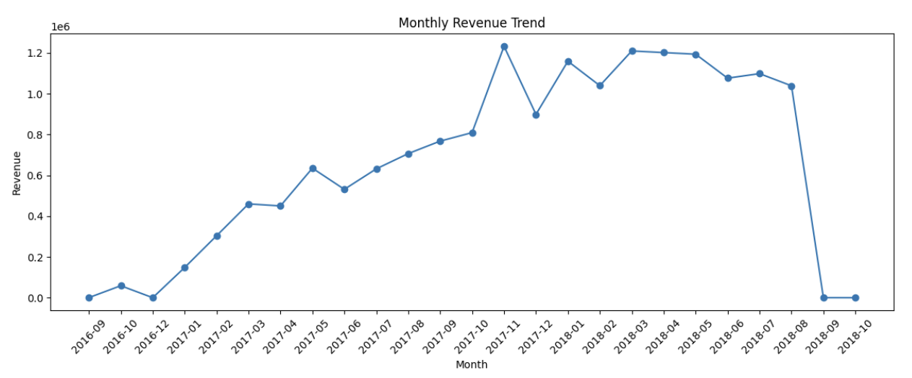
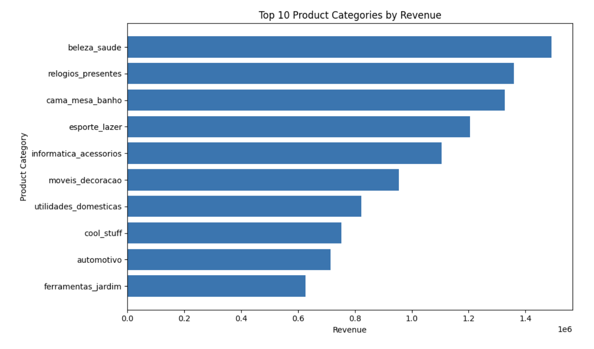
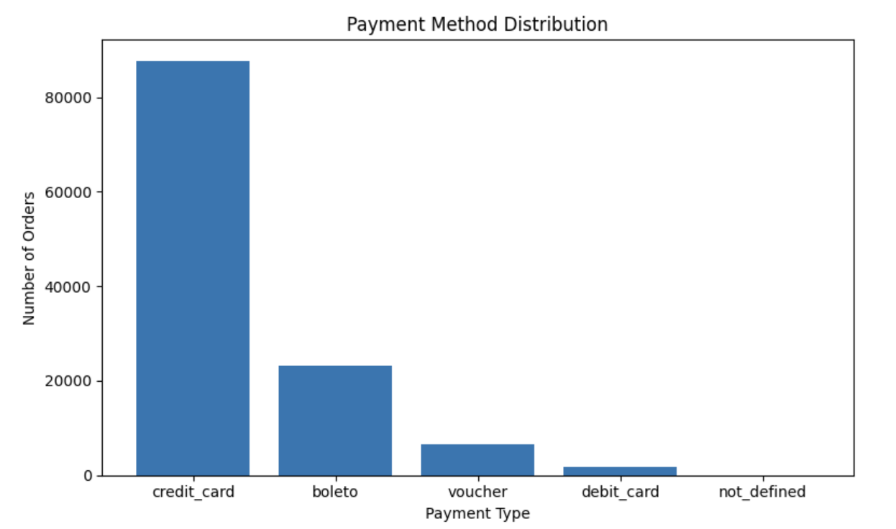
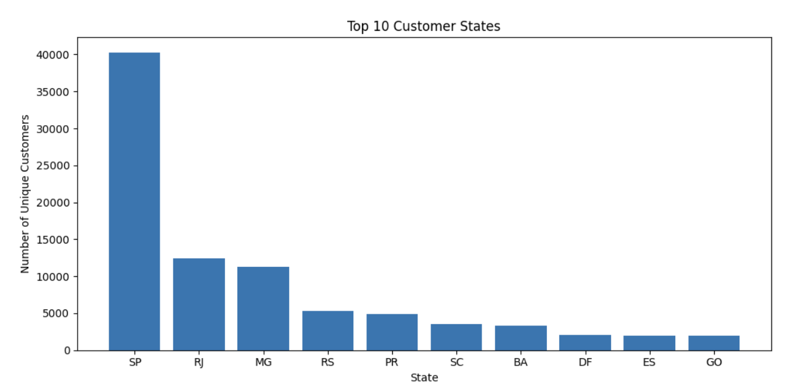
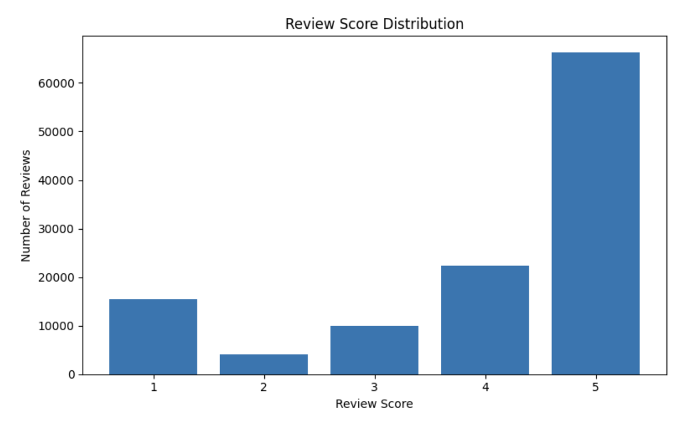

# E-Commerce Sales Analysis: Revenue, Delivery, and Customer Insights

## Project Overview

This project analyzes the Brazilian E-Commerce Public Dataset by Olist to uncover sales trends, customer purchasing behavior, payment preferences, delivery performance, and customer satisfaction.

Using Python, Pandas, Matplotlib, and Seaborn, the analysis transforms raw transactional data into actionable business insights and recommendations that can support business decision-making.

---

## Author

**Zay Hlyan Htet**

* LinkedIn: www.linkedin.com/in/zayhlyanhtet
* GitHub: https://github.com/Holywater2k1

---

## Dataset Information

Dataset: Brazilian E-Commerce Public Dataset by Olist

The dataset contains over 100,000 e-commerce orders and includes information about:

* Orders
* Customers
* Products
* Sellers
* Payments
* Reviews
* Delivery Performance

---

## Business Questions

1. What is the monthly revenue trend?
2. Which product categories generate the highest revenue?
3. Which states have the most customers?
4. What payment methods are most commonly used?
5. What is the distribution of customer review scores?
6. How does delivery performance impact customer satisfaction?

---

## Tools & Technologies

* Python
* Pandas
* NumPy
* Matplotlib
* Seaborn
* Jupyter Notebook
* Kaggle

---

## Project Structure

e-commerce-sales-analysis/

├── notebook/
│   └── ecommerce_sales_analysis.ipynb
│
├── visuals/
│   ├── monthly_revenue.png
│   ├── top_categories.png
│   ├── payment_methods.png
│   ├── customer_states.png
│   └── review_scores.png
│
├── README.md
├── requirements.txt
└── .gitignore

---

## Exploratory Data Analysis

### Monthly Revenue Trend



Revenue fluctuates across different months, suggesting seasonal demand patterns and periods of increased customer activity.

---

### Top Product Categories



A small number of product categories contribute a large portion of total revenue, indicating key revenue-driving segments.

---

### Payment Method Distribution



Customer payment preferences reveal opportunities to optimize checkout experiences and promotional strategies.

---

### Customer Distribution by State



Customer demand is concentrated in specific regions, highlighting potential target markets for growth.

---

### Review Score Distribution



Most customers provided positive ratings, indicating generally high customer satisfaction.

---

## Key Insights

* Revenue shows clear monthly fluctuations and possible seasonality.
* A limited number of product categories generate a significant portion of total revenue.
* Customer demand is concentrated in several high-performing states.
* Certain payment methods dominate customer transactions.
* Customer satisfaction is generally positive but can be impacted by delivery performance.

---

## Business Recommendations

1. Focus marketing efforts on high-performing product categories.
2. Improve inventory planning during peak sales periods.
3. Target high-demand regions with localized campaigns.
4. Optimize delivery operations to improve customer satisfaction.
5. Monitor customer reviews and address recurring issues.

---

## How to Run

1. Clone the repository

```bash
git clone https://github.com/Holywater2k1/e-commerce-sales-analysis.git
```

2. Install dependencies

```bash
pip install -r requirements.txt
```

3. Open the notebook

```bash
jupyter notebook
```

4. Run all cells in the notebook.

---

## Kaggle Notebook

Kaggle Project:

https://www.kaggle.com/code/sillydragon/e-commerce-sales-analysis-revenue-delivery-and

---

## Skills Demonstrated

* Data Cleaning
* Data Transformation
* Exploratory Data Analysis (EDA)
* Data Visualization
* Business Intelligence
* Data Storytelling
* Python Programming
* Statistical Analysis
